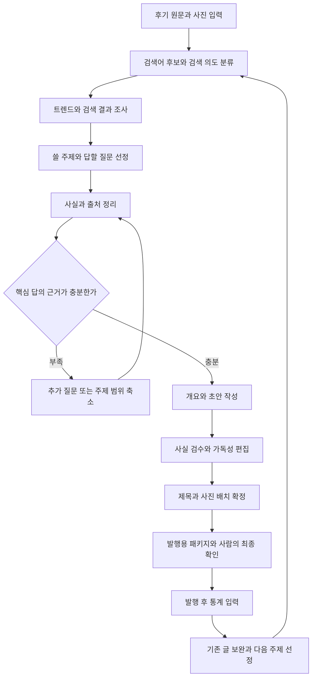

블로그 검색 유입과 가독성을 높이는 자동화 워크플로우 계획

작성일: 2026-09-12. 대상은 현재 자료에 맞춰 네이버 블로그로 가정한다. 아래 수량·평가 배점·운영 주기는 초기 실험을 위한 제안이며, 네이버의 공식 순위 기준이 아니다.

**1. 현재 자료에서 출발할 지점**

읽은 자료는 `naver-blog-prompt.md`, `marketer-insight.md`, `naver-blog-api-guide.md`, `naver-search-trend.md`, `노량진생새우/후기.md` 다섯 파일이다. `후기.md`는 작성자가 제공한 실제 방문·구매·식사 경험의 원본으로 활용한다. `노량진생새우/`에는 HEIC 사진과 MOV 영상도 있다. 발행 URL과 실제 유입 통계는 없어 기존 글의 검색 성과나 독자 반응을 평가할 수는 없다. 사진·영상은 이번 계획에서 파일 목록만 확인했으며, 후기의 각 장면과 일치하는지는 아직 확인하지 않았다.

| 자료 | 살릴 부분 | 바꿀 부분 |
| --- | --- | --- |
| 작성 프롬프트 | 짧은 문장, 모바일 가독성, 자연스러운 어조, 과장 금지 | 홈피드 중심 목표, 1,000~1,400자 고정, 키워드 5회 이상, 소제목 3개 고정, 감정 4회 이상, 반복적인 반전 문구 |
| 마케팅 메모 | 독자가 실제 사용하는 표현과 구체적인 불편 수집 | 다른 사람의 표현을 그대로 복제하거나 공격적인 말투를 일괄 적용하지 않도록 맥락 기록 |
| 블로그 검색 API | 검색 의도와 경쟁 글의 제목·요약·발행일 파악 | 검색 결과 수를 검색 수요로, API 순서를 실제 통합검색 순위로 해석하지 않기 |
| 검색 트렌드 API | 주제 관심도의 변화와 계절성 파악 | 상대지수를 월간 검색 횟수로 해석하지 않기 |
| 노량진 생새우 후기 | 1kg 구매, 초장집 선택·대기 시행착오, 직접 손질한 과정, 음식의 감각 묘사, 두비두밥의 말투 | 방문 당시 경험과 일반 정보를 분리하고 정확한 날짜·실제 결제금액·추가 비용 보완 |

특히 현재 프롬프트는 글을 쓸 때 필요한 사실을 확보하기 전에 감정과 형식을 요구한다. 이를 그대로 자동화하면 정보가 부족한 글에도 ‘의외였습니다’나 ‘여기서 반전이 있습니다’를 채워 넣게 된다. 실제 경험과 구체적인 답을 먼저 확보하고 표현은 마지막에 다듬는 순서로 바꾼다.

네이버 공식 가이드도 경험·출처·읽기 쉬운 구성의 중요성을 설명한다. 다만 서치어드바이저는 웹 콘텐츠 가이드이므로 이를 네이버 블로그의 특정 순위 공식으로 해석하지 않는다. 이 계획에서는 편집 원칙의 근거로 활용한다. [네이버 콘텐츠 작성 권장 사항](https://searchadvisor.naver.com/guide/content-basic)

**2. 목표와 운영 원칙**

우선 목표는 ‘발행 후 28일 동안 검색으로 들어오는 독자 수를 늘리고, 시간이 지나도 유입되는 글을 쌓는 것’으로 둔다. 홈피드·이웃 유입과 검색 유입은 구분해서 본다. 댓글·공감은 보조 신호이며, 많아졌다는 이유만으로 검색 성과가 개선됐다고 판단하지 않는다.

핵심 주제는 작성자가 지속적으로 경험·자료를 공급할 수 있는 1~2개 분야부터 정한다. 폴더 하나만 보고 전체 블로그를 수산물 전문으로 결정하지는 않는다. 보유 소재에 맞는 주제에서 시작하고, 자료 없이 인기 검색어만 따라가는 운영은 피한다.

작성 단위는 ‘검색어 하나’보다 ‘독자가 해결하려는 질문 하나’로 잡는다. 같은 구매 결정을 돕는 가격·위치·포장 정보는 한 글에 묶을 수 있다. 손질법처럼 독자의 다음 행동이 달라지면 별도 글 후보로 분리한다. 비슷한 단어마다 유사한 글을 만들지 않는다.

**3. 전체 흐름**



**4. 단계별 자동화 설계**

| 단계 | 자동으로 할 일 | 산출물 | 다음 단계로 넘어갈 조건 |
| --- | --- | --- | --- |
| 소재 접수 | 소재 폴더의 `후기.md`와 사진 목록을 읽고 경험·의견·외부 확인 항목 분리 | `input.yaml`, `assets.json` | 원문 위치와 주제·보유 근거 식별 |
| 후보 생성 | 지역·대상·문제·구매 조건을 조합하고 의도별로 묶기 | `keywords.json` | 단순 동의어 중복 제거 |
| 수요·검색 결과 조사 | 트렌드 조회, 관련·최신 글의 제목과 요약 수집 | `research.json` | 조회 조건·시점·오류 여부 기록 |
| 기획 | 답할 질문, 대상 독자, 차별점, 제외 범위 결정 | `brief.md` | 핵심 질문과 독자에게 줄 새 정보 명확 |
| 근거 확보 | 주요 주장에 원본 메모·사진·공식 출처 연결 | `evidence.json`, `questions.md` | 핵심 사실에 해결되지 않은 누락 없음 |
| 집필 | 근거를 사용해 개요와 초안 작성 | `draft.md` | 제목이 약속하는 답을 본문에서 제공 |
| 검수·편집 | 숫자·경험·출처·중복·문단·표현 검사 | `qa.json`, `article.md` | 발행을 막는 오류 0건 |
| 발행 준비 | 제목 후보, 대표 사진, 사진 순서·캡션, 모바일 미리보기 | `publish/` | 사람이 바로 확인하고 게시할 수 있음 |
| 성과 환류 | 입력된 통계를 같은 기간끼리 비교 | `performance.csv`, `next-actions.md` | 유지·보완·후속 글의 이유 기록 |

초기에는 로컬에서 단계별 작업을 순서대로 실행하고 JSON·Markdown 파일로 상태를 저장한다. 별도 대시보드는 필요해질 때 추가한다. 외부 API 조회와 형식 검사는 코드로, 의도 분류·기획·집필·편집은 각각 구분된 LLM 호출로 처리한다. 초안을 쓴 결과에 대해 별도의 검수 호출을 하되, 모델의 동의만으로 사실이 검증됐다고 보지 않는다.

**5. 무엇을 쓸지 고르는 방법**

처음에는 소재 하나에서 후보 검색어 약 20개를 만든 뒤 검색 의도 3~5개로 묶는다. 생성한 표현에는 `hypothesis`를 붙이고, 검색 결과·사용자가 제공한 댓글·실제 유입 검색어에서 관찰한 표현에는 출처와 함께 `observed`를 붙인다. LLM이 만든 검색어를 사람들이 많이 찾는 검색어라고 보고하지 않는다.

검색 조사는 다음 순서로 진행한다.

1. 관심도는 최근 12개월과 최근 8주를 각각 조회해 계절성과 최근 변화를 살핀다. 비교 대상은 가능하면 같은 요청·기간·기기 조건에 넣는다. 서로 다른 응답에서 각각 정규화된 지수를 그대로 비교하지 않는다. 후보가 많으면 초기에는 묶음별로 평가하고 전역 순위를 만들지 않는다.
2. 의도별 대표 검색어에 대해 블로그 검색 API를 `sort=sim`, `sort=date`로 각각 조회한다. 초기 표본은 각 20개로 제한하고 URL 중복을 제거한다.
3. 제목·요약에서 반복되는 질문과 정보 항목을 찾는다. 본문을 보지 못한 글은 정보가 없다고 단정하지 않는다. 중요 후보는 접근 가능한 원문 3~5개를 추가 확인하고 확인 범위를 저장한다. 접근할 수 없다면 수동 확인 대상으로 남긴다.
4. 실제 검색 화면의 구성은 별도로 표본 확인한다. API 결과만으로 인기글·지도·쇼핑 등의 통합검색 화면을 재현했다고 보지 않는다.
5. 보유 자료로 더 구체적이고 최신인 답을 줄 수 있는 주제를 우선한다. 차별점이 없거나 핵심 근거를 구할 수 없는 후보는 보류한다.

내부 우선순위는 각 항목 0~5점으로 시작한다. 배점은 검색엔진 공식을 뜻하지 않으며, 모든 점수에 판단 근거를 붙인다.

| 평가 항목 | 비중 | 높은 점수를 줄 상황 |
| --- | --- | --- |
| 직접 제공할 수 있는 근거 | 30% | 실제 기록·사진·실험 등으로 핵심 질문에 답할 수 있음 |
| 검색 의도의 명확성 | 25% | 독자가 원하는 답과 행동을 구체적으로 설명할 수 있음 |
| 기존 글보다 보완할 부분 | 20% | 확인한 글에서 빠진 조건·비교·절차를 제공할 수 있음 |
| 수요의 방향과 시기 | 15% | 동일 조건에서 상승·계절적 관심을 관찰함 |
| 블로그 주제와의 연결 | 10% | 기존 글과 연결되고 후속 소재가 있음 |

데이터가 없으면 0점 대신 ‘미확인’으로 남기고 조사 대상으로 분리한다. 수요를 확인하지 못한 세부 검색어는 상위 주제의 트렌드를 참고할 수 있으나, 해당 검색어의 수요가 검증됐다고 표현하지 않는다.

검색 트렌드 `ratio`는 상대값이다. 블로그 검색의 `total`은 결과 수이고, `description`은 본문 전체가 아닌 요약이다. 두 API만으로 절대 검색량·글 조회수·예상 조회수를 계산하지 않는다. [검색 트렌드 API](https://api.ncloud-docs.com/docs/naver-api-hub-search-trend), [블로그 검색 API](https://api.ncloud-docs.com/docs/naver-api-hub-search-blog)

**6. 정보가 풍부해지는 장치: 사실 기록표**

기획 단계에서 ‘독자가 이 글만 읽고 다음 행동을 결정할 수 있는가’를 확인한다. 방문·구매 후기라면 날짜, 장소, 대상 품목, 단위 가격, 추가 비용, 구매량, 이동·포장 조건, 장단점 중 해당 글의 질문에 필요한 항목을 채운다. 사용법이라면 준비물, 순서, 실패 상황, 해결법, 완료 확인 방법을 채운다. 모든 글에 동일한 정보 목록을 강제하지 않는다.

각 주장은 다음 정보를 갖는다.

```json
{
  "claim_id": "C01",
  "claim": "이곳에 검증할 구체적인 사실을 기록",
  "kind": "personal_experience",
  "source_ref": "input.yaml#notes",
  "observed_at": null,
  "checked_at": null,
  "scope": "해당 방문 또는 구매 조건",
  "status": "needs_confirmation"
}
```

사실 유형은 직접 경험, 외부 출처, 작성자 의견, 추론으로 구분한다. 가격·영업시간처럼 바뀌는 사실은 기준일과 적용 조건을 남긴다. 출처가 충돌하면 최신성뿐 아니라 지점·품목·단위·거래 조건이 같은지 확인한다.

`후기.md`를 기본 입력으로 받아 자유롭게 쓴 글에서 구매·이동·대기·손질·식사 순서를 추출한다. 사용자가 같은 내용을 다시 양식에 작성할 필요는 없다. 원문은 보존하고 `input.yaml`은 파생 자료로 만든다. 각 근거에는 원본 파일 경로와 해당 문장을 연결한다. 직접 경험은 `author_reported`로 기록하고 외부 자료로 검증한 사실과 구분한다. 작성자가 명시한 경험에 일괄적으로 재확인을 요구하지 않는다.

입력에서 빠진 사실, 뜻이 모호한 수치, 현재도 유효하다고 쓰려는 운영 정보만 `questions.md` 또는 외부 조사 목록으로 보낸다. ‘이번주 목요일’ 같은 상대 날짜는 파일 수정일이나 실행일로 확정하지 않는다. 가격 범위가 적혀 있더라도 실제 지불액을 임의로 고르지 않는다. 개인 경험의 시간·맛·인상은 그 방문과 작성자의 평가로 한정한다.

사진 OCR은 보조 자료다. 흐린 가격표의 숫자, 품종, 촬영일을 확정하지 않는다. 사진만 보고 맛·친절도·재방문 의사를 만들어내지 않는다. HEIC 미리보기와 MOV 대표 프레임을 만든 뒤, 각 이미지를 어느 질문의 설명·증거로 쓸지 연결한다. 영수증이나 가격표가 실제로 있는지는 이 단계에서 확인한다.

사람에게 묻는 내용은 한 번에 묶는다. 예: 방문일, 정확한 구매 내역, 지불 금액, 실제로 불편했던 점. 답이 없으면 해당 내용을 제외하거나 더 좁은 주제로 다시 기획한다. 제목의 핵심 약속에 필요한 정보가 없다면 발행 준비 상태로 넘어가지 않는다.

건강·법률·금융 등은 표현을 ‘도움이 될 수 있다’로 완화하는 것만으로 근거 문제가 해결되지 않는다. 해당 주제를 다룰 때는 신뢰할 수 있는 원문 근거를 확보하고 적용 범위를 확인한다.

**7. 잘 읽히는 글로 만드는 집필 규칙**

글의 길이와 소제목 수는 답할 질문의 수와 복잡도에 맞춘다. 기본 구성은 ‘짧은 답 → 조건과 근거 → 구체적인 경험·비교 → 독자의 다음 행동’으로 한다. 검색 유입을 노리는 글은 도입에서 답을 일부러 늦추지 않는다.

| 요소 | 새 규칙 |
| --- | --- |
| 제목 | 핵심 대상과 얻을 정보를 명확히 표현. 본문에서 확인되지 않은 가격·연도·최고·최저 등의 약속 금지 |
| 도입 | 누구에게 필요한 글인지, 핵심 답, 기준일이나 적용 조건을 짧게 제시 |
| 소제목 | ‘여기서 결과가 달라집니다’보다 ‘포장할 때 추가 비용이 드는가’처럼 내용을 예측할 수 있게 작성 |
| 본문 | 문단마다 한 가지 역할. 수치에는 단위·조건, 경험에는 실제 근거를 연결 |
| 정보 배치 | 가격 비교는 표, 절차는 순서 목록, 현장 설명은 사진과 캡션으로 전달 |
| 키워드 | 제목과 필요한 본문 위치에 자연스럽게 사용. 반복 횟수 목표 삭제 |
| 말투 | 작성자가 실제로 쓴 메모의 어조를 참고. 감탄·반전·감정 횟수는 강제하지 않음 |
| 마무리 | 추천 대상과 판단 기준, 필요한 다음 행동. 관련 후속 글이 이미 있으면 자연스럽게 연결 |

독자 표현 수집에는 ‘원래 표현 / 상황 / 실제 질문 / 출처 / 글에 쓸 쉬운 표현’을 함께 저장한다. 욕설이나 남의 독특한 문장을 복제하기보다 독자가 어디서 막히는지 파악하는 데 쓴다.

초기 프롬프트는 다음 책임으로 분리한다.

1. 조사: 관찰한 검색어와 추정 후보를 분리하고 조사 한계를 기록한다.
2. 기획: 한 가지 핵심 의도, 반드시 답할 질문, 보유한 차별점, 필요한 추가 근거를 정한다.
3. 집필: 기획서와 검증된 근거만으로 쓰고, 정보가 비면 미확인으로 반환한다.
4. 사실 검수: 문장별 주요 주장과 근거를 대조하고 수정 위치를 반환한다.
5. 편집: 답을 앞에 두고 반복·빈말을 줄인다. 편집 과정에서 새로운 사실을 추가하지 않는다.
6. 제목: 최종 본문을 읽고 후보 3개를 만든다. 명확성·구체성·본문 일치도를 비교해 1개를 제안한다.

**8. 발행 전 통과 기준**

자동 검사는 판단 근거와 해당 문장 위치를 출력해야 한다. ‘SEO 95점’ 같은 단일 점수만 내보내지 않는다.

| 검사 | 통과 기준 |
| --- | --- |
| 검색 의도 | 기획서의 필수 질문에 모두 답하거나 다루지 않는 범위를 명시 |
| 제목과 본문 | 제목의 모든 약속에 대응하는 본문·근거 존재 |
| 사실성 | 핵심 수치·날짜·상호·경험에 추적 가능한 출처 존재 |
| 정보의 구체성 | 독자가 비교·방문·구매·실행할 때 필요한 조건 포함 |
| 독창성 | 직접 경험 또는 독자적인 정리·검증·비교가 구체적으로 존재 |
| 읽기 편함 | 핵심 답이 앞에 있고, 문단·소제목·사진이 질문 해결에 기여 |
| 중복 | 기존 글과 검색 의도가 겹치면 신규 발행보다 기존 글 보완 검토 |
| 발행 완성도 | 빈칸·내부 근거 ID·깨진 링크 없음, 사진과 캡션 일치 |

사실 오류, 가짜 경험, 제목과 내용의 불일치, 핵심 답 누락은 발행을 막는다. 단순 문체 취향은 권고로 남긴다. 자동 수정은 최대 두 번까지만 시도하고, 이후에는 실패한 항목과 필요한 자료를 반환한다.

키워드 남용과 내용만 조금 바꾼 대량 발행은 성장 전략으로 삼지 않는다. 네이버는 이러한 행위를 웹 콘텐츠 스팸 사례로 설명하며, AI 사용 여부 자체만으로 판단하지 않는다고 안내한다. [네이버 웹 콘텐츠 스팸 사례](https://searchadvisor.naver.com/guide/content-abusing)

**9. 발행과 측정의 현실적인 범위**

초기 자동화의 완료 지점은 ‘검수된 원고 + 사진 배치 + 복사 가능한 발행 패키지’로 한다. 현재 확보한 API 두 개는 조회용이며 글쓰기 기능을 제공하지 않는다. 사람은 마지막에 실제 경험과 표현을 확인하고 네이버 편집기에서 게시한다. 자동 발행 연동은 별도 기능으로 분리하고, 구현 시점에 지원되는 연동 경로를 확인한 후 설계한다.

발행 패키지에는 최종 제목, 본문, 대표 사진, 본문 사진 순서와 캡션, 관련 태그 제안, 출처, 미리보기를 넣는다. 사진에만 있는 핵심 숫자는 본문에도 적는다. 내부 검수 기록은 게시용 원고에서 제거한다.

발행 후 7·14·28일에 통계를 기록하고 장기 유입은 월별로 본다. 네이버 블로그 도움말은 유입 경로와 하위 검색어 목록을 제공한다고 안내한다. 실제 계정에서 확인 가능한 기간·게시글 단위·지표 범위를 먼저 점검한다. [네이버 블로그 유입 분석 안내](https://help.naver.com/service/5593/contents/15330?lang=ko&osType=COMMONOS)

| 지표 | 사용 방법 |
| --- | --- |
| 글별 7일·28일 조회수 | 발행 후 같은 경과 기간의 글끼리 비교 |
| 검색 유입 수·검색어 | 제공되는 집계 단위에서 핵심 성과로 추적 |
| 홈피드·이웃 등 유입 | 화면에서 구분되는 범위에서 검색과 나눠 기록 |
| 댓글의 질문 | 빠진 답을 찾고 원고 보완·후속 글 후보로 전환 |
| 평균 사용 시간 등 | 제공되는 집계 범위를 기록하고 보조적으로 활용 |
| 제작·수정 시간 | 편당 사람의 작업 시간과 검수 재작업이 줄었는지 확인 |

통계 API나 내보내기 기능이 있다고 가정하지 않는다. 초기에는 계정 화면에서 확인한 수치를 정해진 CSV에 입력하고 분석부터 자동화한다. 게시글별 검색 유입이 확인되지 않으면 블로그 전체 지표와 글별 조회수를 별도로 기록하고 둘을 임의로 결합하지 않는다. 제공되지 않는 값은 0이 아닌 결측으로 둔다.

노출 수와 클릭 수를 같은 범위로 확보한 경우에만 CTR을 계산한다. 조회수만으로 CTR이나 완독률을 추정하지 않는다. 글별 체류시간을 얻지 못하면 블로그 전체 평균을 글별 성과로 사용하지 않는다.

개선 의사결정은 다음과 같이 한다.

- 검색 유입이 약하다: 실제 검색 화면에서 노출 여부, 계절 변화, 검색 의도 적합성, 경쟁 글의 답을 다시 확인한다. 조회수만 보고 제목 문제로 단정하지 않는다.
- 예상하지 않은 검색어로 유입된다: 글의 의도와 맞으면 답을 보완하고, 다른 의도라면 별도 글 후보로 만든다.
- 댓글에서 같은 질문이 반복된다: 해당 답을 본문에 추가한다.
- 가격·운영 정보가 달라졌다: 근거와 확인일을 갱신하고 수정 이력을 기록한다.
- 일부 글이 잘된다: 표현을 그대로 복제하기보다 주제·근거·정보 구성 중 재현 가능한 요소를 찾는다.

한 번에 한 요소를 바꾸고 변경일을 남긴다. 제목 후보 3개를 만든 것을 A/B 테스트라고 부르지 않는다. 비슷한 주제의 글이나 수정 전후를 비교할 때도 계절성·글의 나이·검색 노출 변화가 섞여 있으므로 인과관계 확정 대신 다음 실험의 근거로 쓴다.

**10. `노량진생새우`로 해볼 첫 시범 작업**

`노량진생새우/후기.md`에 따라 첫 글은 ‘생새우 1kg을 구매해 전라도 초장집에서 두 사람이 직접 손질해 먹은 후기’로 기획한다. 기존의 포장 중심 예시는 실제 경험에 맞춰 현장 식사 중심으로 바꾼다. 아래 경험은 작성자의 기록에 근거하며 검색 수요, 현재 영업 정보, 사진 내용은 아직 별도로 확인하지 않았다.

| 항목 | 기획 |
| --- | --- |
| 대상 독자 | 노량진에서 생새우를 사서 초장집에서 먹어보려는 사람 |
| 핵심 의도 | 구매부터 초장집 식사까지 비용·대기·손질 과정이 어떻게 되는가 |
| 검색어 가설 | 노량진 생새우 가격, 노량진 생새우 초장집, 노량진 전라도 초장집, 노량진 생새우 손질 |
| 이미 확보한 소재 | 1kg 구매, 서너 곳 가격 확인, 평일 저녁 대기, 전라도 선택, 두 사람의 직접 손질, 버터구이·오징어튀김 평가 |
| 보완할 핵심 자료 | 정확한 방문일, 생새우 실제 결제액, 초장집 비용과 추가 메뉴 비용, 방문한 전라도의 정확한 위치 |
| 제목 후보 | 노량진 생새우 1kg 후기: 전라도 초장집 대기와 직접 손질한 경험 |
| 본문 순서 | 경험 요약 → 구매 가격·식사 비용 → 초장집 선택과 대기 → 직접 손질 → 맛과 추가 메뉴 → 다음 방문 때 참고할 점 |
| 차별화 | 가게를 옮기다 대기 순번이 밀린 경험, 두 사람이 직접 손질한 수고, 식사까지 이어지는 구체적인 과정 |

후기에서 추출할 정보와 집필 시 적용 범위는 다음과 같다.

| 원문에 있는 정보 | 계획에 반영하는 방법 | 보완·검수 사항 |
| --- | --- | --- |
| 이번주 목요일, 평일 저녁 8시 이후 방문 | 방문 당시 상황으로 서술 | 정확한 연월일만 추가 확인 |
| 1kg당 37,000~38,000원, 서너 곳 가격이 같았음 | 둘러본 가게에서 확인한 당시 가격대로 기록 | 실제 결제액과 구분. 시장 전체 시세·어느 가게나 동일하다는 표현으로 확대하지 않음 |
| 생새우 1kg 구매, 판매자가 위층 초장집 안내 | 구매부터 식사까지의 이동 흐름에 사용 | 구매처 상호는 기록·사진에서 찾고, 못 찾으면 추정하지 않음 |
| 또순이·전라도를 24시간 운영하는 곳으로 찾음 | 늦은 시간에 초장집을 찾게 된 맥락으로 활용 | 현재 24시간 영업 여부는 공식 안내 등으로 확인 전까지 단정하지 않음 |
| 전라도에서 대기, 여러 곳을 찾다 순번이 밀림 | 글의 실용적인 차별점으로 사용 | ‘방문 당시 경험’으로 한정. 모든 초장집의 공통 대기 규칙으로 쓰지 않음 |
| 두 사람이 1kg을 30분 이내에 직접 손질 | 손질을 선택할 때 고려할 수고를 설명 | 누구나 같은 시간에 가능하다는 보장으로 바꾸지 않음 |
| 내장 제거, 탱글한 식감, 막장·마늘 쌈 | 작성자가 실제 먹은 방식과 감상으로 사용 | 생식 안전성이나 검증된 위생 지침으로 확대하지 않음 |
| 새우머리 버터구이, 오징어튀김이 맛있었음 | 식사의 흐름과 개인적인 추천 이유에 사용 | 수산시장 아래층이라 신선하다는 인과는 추정으로 분리 |
| 이용 시간 2시간, 늦게 방문해 뒤에 대기가 없었음 | 당시 이용 경험으로 서술 | 시간 제한 면제나 현재 운영 규칙으로 일반화하지 않음 |
| 가을이 새우 제철이라는 표현 | 외부 확인이 필요한 배경 정보로 분리 | 품종과 유통 형태가 불명확하므로 검증 없이 일반화하지 않음 |

현재 후기만으로는 식사 총비용을 계산할 수 없다. 생새우 가격과 초장집 상차림·손질·조리·추가 메뉴 비용을 구분하고, 실제로 발생했는지와 금액이 확인된 항목만 합산한다. 원문에 손질 서비스를 선택할 수 있었다는 내용은 있지만 서비스 가격은 없으므로 무료라고 쓰지 않는다. 둘이 1kg을 손질했다는 기록을 ‘2인 적정량’으로 바꾸지 않는다.

추가 질문은 우선 방문일, 실제 결제 내역, 전라도 위치로 묶고 원문에 있는 맛·대기 경험·구매량은 다시 묻지 않는다. 자료가 보완되지 않으면 제목에서 총비용·현재 시세·24시간 영업 약속을 제외하고 확인된 경험 중심으로 범위를 줄인다.

문체는 ‘두비두밥’의 실제 어조를 기준으로 한다. ‘생새우만 조진다는 마인드’, ‘언제 또 생새우를 까보냐’처럼 개성이 있는 표현은 상황에 맞게 살리고, 반복 감탄과 오탈자를 정리한다. 핵심 답을 먼저 제시한 뒤 릴스를 보고 먹고 싶어졌던 동기를 짧게 연결해 검색 정보와 후기의 개성을 함께 유지한다.

사진은 구매한 새우·초장집·손질 전후·버터구이·오징어튀김 장면이 실제 있는지 확인한 후 해당 문단과 연결한다. 파일명만으로 장면을 배정하지 않으며 없는 사진이나 경험을 생성해 채우지 않는다. 손질·보관을 독립적인 사용법 글로 확장하려면 추가 경험과 필요한 근거를 먼저 확보한다.

이 시범 작업의 결과물은 주제 선정 이유, 부족한 자료 질문, 사실 기록표, 초안, 검수표, 발행 패키지다. 이 한 편에서 사람이 어디에 시간을 쓰는지 확인한 후 반복 부분을 자동화한다.

**11. 구현 순서와 완료 기준**

| 순서 | 작업 | 완료 기준 |
| --- | --- | --- |
| 1. 시범 원고 | `후기.md` 정보 추출과 사진 연결, 기획·근거·작성·검수 프롬프트 분리 | 실제 소재 한 편이 근거와 함께 발행 준비 상태에 도달 |
| 2. 조사 자동화 | API 인증·응답 저장, 검색어 분류, 트렌드·검색 결과 보고서 | 관찰값과 추정값을 구분하고 동일 입력을 재현 가능 |
| 3. 반복 실행 | 소재 폴더 입력부터 원고·미리보기 생성까지 연결 | 실패 단계부터 재개 가능하고 원본·초안 버전 보존 |
| 4. 성과 환류 | 통계 CSV 입력, 7·14·28일 비교, 개선 목록 생성 | 발행 글마다 다음 행동과 근거가 기록됨 |

구현 시에는 작업 ID, 입력 해시, 조사 시점, 프롬프트 버전, 모델 식별자, 단계별 상태를 남긴다. 캐시를 사용하고 재실행 시 기존 결과를 덮어쓰지 않는다. 인증 실패는 조치 필요 상태로, 일시 오류는 제한된 재시도로 처리한다. 조사 실패를 수요 없음으로 바꾸지 않는다. 글별 API·모델 사용량과 비용도 기록한다.

기능 확인은 검색 결과 정리, 상대지수 조건 보존, 미확인 사실 차단, 실패 후 재개를 중심으로 한다. 원고 평가는 실제 소재로 수행하며, 사실 없는 입력을 넣었을 때 경험담이 생성되지 않는지 반드시 확인한다.

초기 운영은 주 2편씩 4주, 총 8편을 제안한다. 이는 실행 가능한 가설 검증 규모일 뿐 발행량 자체의 효과를 주장하는 수치가 아니다. 기존 글 통계를 얻으면 유사 주제·동일 경과일 기준선을 만들고, 없으면 첫 묶음을 기준선으로 삼는다. 4주차에는 초기 결과를 보고 운영을 조정하되, 마지막 글의 28일 관찰이 끝난 약 8주차에 첫 묶음을 종합 평가한다. 작은 표본이므로 성공 공식 확정은 하지 않는다.

워크플로우의 완료 기준은 입력 소재에서 검수 가능한 발행 패키지가 나오고, 발행 후 결과가 다음 기획으로 돌아오는 것이다. 성과 판단은 글별 검색 유입의 확보 가능 범위, 28일 조회수의 중앙값, 사실 오류·재작업, 사람의 편당 작업 시간을 함께 본다. 구체적인 증가 목표는 실제 기준선을 확보한 뒤 정한다.
